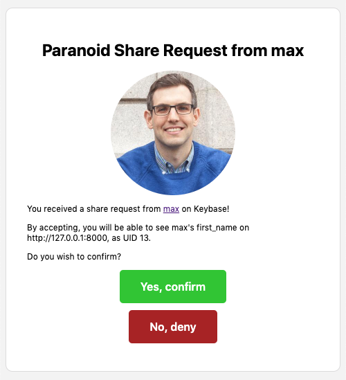

# _Paranoid_: Privacy through Granular Separation of Identities

This is a project submission for CSCI 2390 Privacy-Conscious Computer Systems.

## Introduction

Paranoid aims to allow you to regain control of your own personal data. We explore a new paradigm of designing web
services to present personal data on HTML webpages without having access to the data itself. Paranoid achieves this by
storing all personal data separately outside of the service, displaying them on the client side using browser DOM
manipulation using a browser extension, and explicitly sharing data files with other users securely using Keybase. We
show that such an approach is secure against untrusted services via various attack vectors.

## How it works

### Single Sign-On (SSO)

Paranoid provides a single sign-on (SSO) mechanism, similar to how users can log in to third-party services using their
Google or Facebook accounts via OAuth 2.0. However, instead of sharing private data such as email address, name, etc.
during registration, a new service identity is generated, which includes a private/public key pair. The public key
portion is transmitted to the service, which uses it to authenticate the user for future logins.

User authentication for the service is done using a challenge-response authentication scheme, where the service provides
a randomly generated nonce challenge encrypted using the provided public key, and the user must prove they can retrieve
the original nonce value by decrypting it with the corresponding private key.

### Browser Extension DOM Manipulation

The Paranoid browser extension can look for `<paranoid>` placeholder HTML tags in the web page, where the corresponding
data values can be substituted accordingly. This allows the web service to still present a web page using these
placeholder tags without having access to the private data itself, which will be presented correctly to users who have
access to the private data (which has to be explicitly granted by the data owner).

### Closed Shadow DOM Specification

If we naively perform DOM manipulation to replace the HTML tags directly in the DOM, the (untrusted) service would still
be able to extract the already-replaced HTML tags to retrieve the private information using client-side JavaScript.
A notable example would be [British Airways' data breach in 2018](https://www.cnet.com/news/heres-how-british-airways-was-hacked-according-to-researchers/),
where malicious client-side JavaScript that was injected to their website was able to siphon credit card information
from users when the forms were submitted.

Instead, we make use of the the [Shadow DOM specification](https://developers.google.com/web/fundamentals/web-components/shadowdom),
which is supported by most major browsers today. This allows us to create HTML tags which cannot be introspected by
other JavaScript code running on the same page.

It might still be possible for malicious JavaScript code executing on the same page to overload the `Element.prototype.attachShadow`
method with a malicious implementation. However, we execute the Shadow DOM manipulation inside of
[content scripts](https://developer.chrome.com/extensions/content_scripts), which isolates any changes to the JavaScript
environment made by the page itself from affecting the browser extension, and vice versa. We could not find a workaround
that allows the page's JavaScript code to break out of this isolation and extract the actual data values in any way.

### Using Keybase for Sharing Data Files

We chose to split private data by field (e.g. email address) for each identity, so that different parts of a service
identity can be granted to a different set of users. As such, a single data file contains the private data value for
a single `<origin, uid, field_name>` tuple, or a _field tuple_.

We chose to use Keybase as our storage and transport mechanism as it already provides both authenticity and
confidentiality guarantees out of the box, as well as other neat features like filesystem abstractions (KBFS) and a
message passing mechanism (Keybase Chat).

KBFS is a network-backed filesystem, which can be mounted on local machines using Filesystem in Userspace (FUSE)
or accessed via command-line interfaces. In particular, it provides the `/keybase/private` top-level folder (TLF),
where all files are both signed (ensuring integrity) and encrypted (ensuring confidentiality), while files in the
`/keybase/public` TLF are only signed by default. This provides the property that all data files will be encrypted at
rest, and we can be sure that it has not been tampered with.

On the other hand, Keybase also uses the [saltpack](https://saltpack.org/) message format for encrypting data for
multiple users. The message is encrypted using each recipient's private key separately, such that each user would be
able to decrypt the message independently using their own key. Furthermore, saltpack allows the public keys of
recipients to be hidden in the encrypted message format. We found that this encrypted message format is amenable to
storing data files due to the above two properties mentioned.

In the case of Paranoid, we store most metadata in the `/keybase/private` TLF, including information about services and
identities, as well as the generated public/private key pair for an identity. On the other hand, we store data files,
which can be shared with other users, in the `/keybase/public` TLF, encrypted using the keys of all users who have
access to them, which does not expose the private values to anyone who does not have access, and also does not expose
the set of users which have access to a given data file.

In order to not expose the list of services and the corresponding UIDs that a Keybase user has registered for, we use a
deterministic hash function (specifically, SHA-256) to hash the field tuple as the filename for the data file. This
still allows recipients to access the data file in the owner's `/keybase/public` TLF as long as they keep track of the
list of data files that they have access to.

KBFS also does not provide a push-like synchronization mechanism (like Dropbox), but instead clients must pull files
on demand. While this still allows a recipient to be aware of any changes to a data file that they had previously been
granted access to by pulling the data file again from the owner's public TLF, we need to construct a way to notify
the recipient that they have been granted access to a new data file.

As such, we introduce the notion of a share request. The owner A chooses to grant access of a data file to a recipient
B, and as such re-encrypts the data file using user B's public key in addition to all previous users' public keys, which
immediately allows user B to decrypt the data file. However, this process is not automatic in Paranoid, and instead we
send a Keybase Chat message originating from user A to user B, of a share request that user A wants to send to B. User B
can then accept the share request, which would keep track of the field tuple in its private storage, and thus allowing
the browser extension to now replace tags corresponding to user A on the service's web page.

## Implementation

Paranoid is implemented as a Chromium browser extension and a local HTTP daemon server. The browser extension provides
a user interface for managing service identities and sharing options, as well as to perform the DOM manipulation on
service webpages accordingly, while the daemon server interfaces with Keybase and responds to HTTP requests from the
browser extension.

## Security

### Encryption

We make use of Keybase to provide encryption at rest of private data files. One other alternative we considered was to
simply store the data within HTML5 `localStorage`, but we found that it was implemented as an unencrypted database
on the filesystem as an IndexedDB file, available to all processes on the machine, even after the machine is shut off.
On the other hand, all files in KBFS are stored encrypted, and require the user key to decrypt them.

As such, no keys or data files are stored in localStorage such that it can be accessible by JavaScript, and instead all
secrets must be accessed via the daemon server.

### Cross-Site Request Forgery (CSRF)

The daemon server sends all data files unencrypted to the browser extension, and thus it is crucial to lockdown access
to the daemon server as much as possible. Furthermore, the browser extension has to be able to access the daemon server
from the context of any origin, since it operates on the service's web page itself, and thus we have to enable
Cross-Origin Resource Sharing (CORS) for all origins on the daemon server. This opens up the possibility for malicious
JavaScript to make unauthorized requests to the daemon server to exfiltrate secrets such as private keys or private data
files using Cross-Site Request Forgery (CSRF).

While the typical CSRF protection usually involves browser enforcement of CORS or using CSRF tokens, this does not apply
in our case, since requests have to be made automatically when a page is loaded for an untrusted origin. We realised
the key idea is to perform authentication such that only the browser extension is able to make the request, and not
arbitrary JavaScript on the page.

We thus generate a session token on each run of the daemon server, which has to be made known to the browser extension.
We use a HTTP `Authorization` header to authenticate all incoming HTTP requests, and reject the request if the session
token does not match. This session token is stored within the extension's localStorage IndexedDB location, instead of
a per-origin localStorage, and thus provides isolation against untrusted JavaScript from third party web pages.

### Man-in-the-Middle (MITM)

To prevent MITM attacks, the communication between the browser extension and the daemon server should strictly be
restricted to the loopback interface to minimize the attack surface. This prevents others on the same network from
snooping on individual requests.

To further protect against MITM, we can set up HTTPS on top of the daemon server running on localhost. This would
require a self-signed certificate, which typically throws SSL errors in Chrome, and thus the root CA certificate has to
be added to the local machine's certificate keychain.

### Impersonation Attacks

Using our implementation, it is also possible for a user to impersonate another user's service identity. Suppose Alice
is associated with UID 13 on the service `fakebook.com`. However, Harry sends Bob a share request claiming to be
associated with UID 13, and if Bob accepts the share request, Bob would mistakenly think that user 13 on `fakebook.com`
is Harry.

There are several ways to combat this. One possible solution would be for the service itself to provide Bob a mechanism
to prove the identity of a user by supplying user 13's public key, and requesting Alice (or Harry) to decrypt a
challenge with their own private key. However, it is possible for the service to lie about a user's public key,
especially if we do not trust the service.

TODO

## Instructions

### Chromium Extension

1. Go to `chrome://extensions` and enable "Developer Mode".
2. Click "Load unpacked" and select the `extensions/` directory.
3. Make sure to follow the instructions on the welcome page.
   - If protocol handler is not registered, go to `chrome://settings/handlers` to make sure the domain is not blocked.

### Daemon

See [`daemon/README.md`](daemon/README.md).

### Sample App

See [`sample-app/README.md`](sample-app/README.md).
